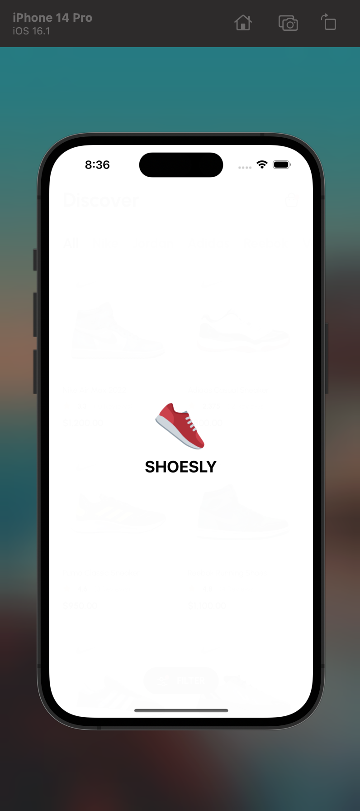
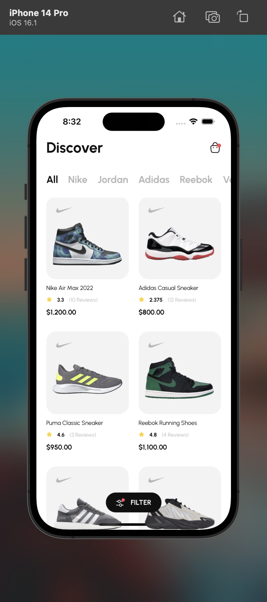
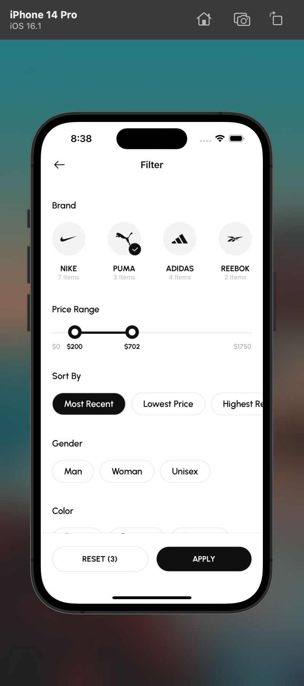
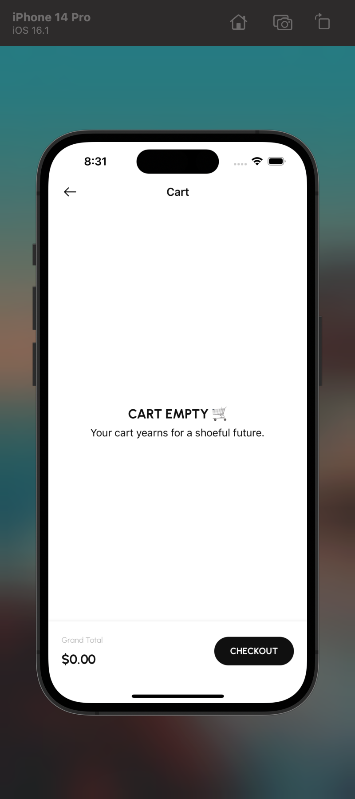
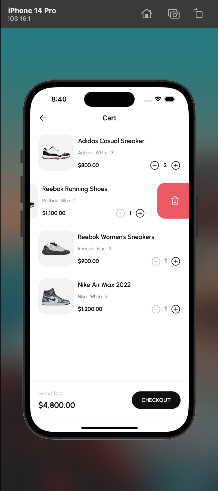
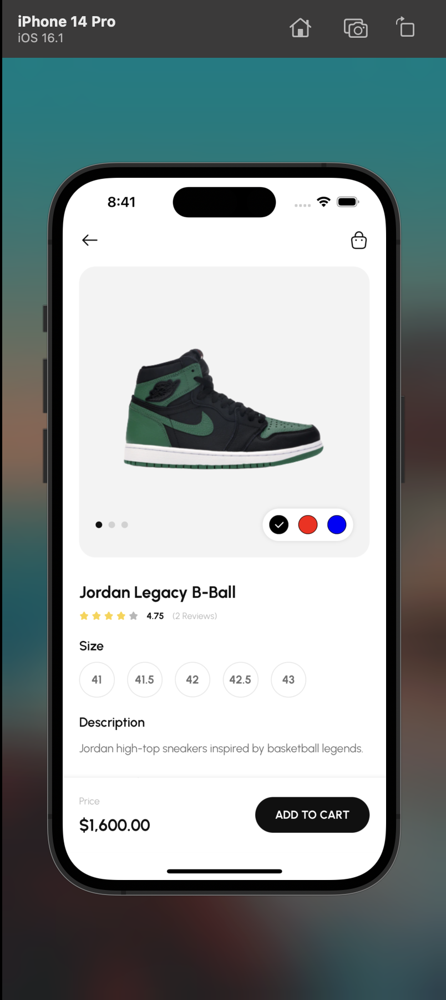

## Getting Started with an Existing Expo Project

### Prerequisites

1. **Node.js and npm:** Make sure you have Node.js installed on your computer. You can download it from [nodejs.org](https://nodejs.org/).

2. **Expo CLI:** Install the Expo CLI globally by running the following command in your terminal if you haven't already:

   ```bash
   npm install -g expo-cli


## Setting Up the Project

open the project in the terminal, follow these steps:

1. **Navigate to the Project Directory:**

   Open your terminal and change your working directory to the root folder of the downloaded/cloned Expo project:

   ```bash
   cd path/to/your/shoesly
  
2. **Install the packages:**
    run this to install the dependencies

    ```bash
   yarn

3. **Start the app**
    run this to start the app

    ```bash
   yarn start


## A break down of what was done in the app
1. Inifinite scroll data fetching
2. Filter logic
3. Cart logic
4. Redux toolki was used for the state management
5. Firebase was used as the database

## Challenges I faced
1. querying the database using the filters was a bit hectic, as i was just getting to know how firebase structures it's data and how it let's you read it.

## What i would do if i am to build this kind of project again
The infinite scroll is a functionality which when built effeciently, could limit and siginificantly reduces heavy data fetching from the database.

Now, here's what i did wrong. In each shoe objects, i included all the reviews, which is really not good production wise. Because, if some shoes manage to get thousands of reviews, despite using infinite scroll to get the shoes in small chunks, i would still be fetching a lot of data that is not needed at the moment.

What i would do in my next try, is to, make the shoe objects as light as possible i.e not add the reviews, instead i would add the reviews id, which would be used to query the reviews database when needed. Hence, reducing the amount of data being fetched.

Overall, it was an exciting project

## Add on
1. Simple yet cool animated splash screen 🙂
2. Adaptive app icons
   
<!-- Row 1 -->
  

<!-- Row 2 -->
  


